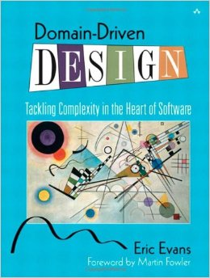

The Eric Evans' book ["Domain-Driven Design - Tackling Complexity in the Heart of Software"](http://amzn.to/2aygz2G) is like a Bible for who intend to use DDD, so, I guess that some quotes of the book can help us to validate our DDD approach.

The list below is just a "check-point list", because, to understand what each one really meaning you need to read book deeply, probably more than one time.

### My tip is: read the book!

### Quotes
> "The objects had behavior and enforced rules. The model wasn't just a data schema; it was integral solving a complex problem." (page 13)

> "The vital detail about the design is captured in the code." (page 37)

> "Running code doesn't lie, as any other document might. The behavior of running code is unambiguous." (page 38)

> "When a model doesn't seem to be practical for implementation, we must search for a new one. When a model doesn't faithfully express the key concepts of the domain, we must search for a new one." (page 49)

> "Isolating the domain implementation is a prerequisite for domain-driven design." (page 75)

> "It is important to constrain relationship as much as possible." (page 83)

> "When we force an operation into an object that doesn't fit the object's definition, the object loses its conceptual clarity and becomes hard to understand or refactor" (page 104)

> "When the users or domain experts use vocabulary that is nowhere in the design, that is a warning sign." (page 207)

> "The concept you need is not always floating on the surface, emerging in conversation or documents. You may have to dig and invent. The place to dig is the most awkward part of your design. The place where procedures are doing complicated things that are hard to explain. The place where every new requirement seems to add complexity." (page 210)

> "Constraints make up a particularly important category of model concepts. They often emerge implicitly, and expressing them explicitly can greatly improve a design." (page 220)

> "When the constraints are obscuring the object's basic responsibility, or when the constraint is prominent in the domain yet not prominent in the model, you can factor it out into an explicit object or even model it as a set of objects and relationships." (page 222)

> "Create explicit predicate-like value objects for specialized purposes. A specification is a predicate that determines if an object does or does not satisfy some criteria." (page 226)

> "A pattern is not a cookbook. It lets you start from a base of experience to develop your solution, and it gives you some language to talk about what you are doing." (page 227)
