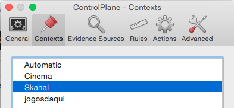
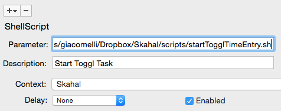

So, do you want to track the time you spend in some tasks, but always forget to start the time tracking?

I love to used Toggl.com to time tracking and a few days ago I discovered another amazing app to OSX: ControlPlane.

ControlPlane, in few words, is an app that allow you change your desktop configuration (opened apps, notifications, etc) when some trigger happens.

In my specific case I would like to track the time I spend programming in the newest Skahal’s pet project, a Space Invaders Remake or as we like to call: SIR. Well, I wanted to start a “Programming” task on Toggl every time I open Unity3D editor and stop the same task when close the Unity3D.<

I followed steps bellow to get this done:

### 1) Create the startTogglTimeEntry.sh
We will create the follow shell script that uses Toggl api to starts a task:

```
echo 'Starting "Programming" task on toggl.com'
curl -v -u <api-token>:api_token \
    -H "Content-Type: application/json" \
    -d '{"time_entry":{"description":"Programming","tags":[],"pid":<project-id>,"created_with":"curl"}}' \
    -X POST https://www.toggl.com/api/v8/time_entries/start
```

As you can see we need to replace two things in this script:

* **API-TOKEN**: this should be replaced by your Toggl api token, go to the bottom of [your Toggl profile page](https://www.toggl.com/app/profile) and get it.
* **PROJECT-ID**: this should be replaced by the id of the project where you want to create the "Programming" task. We need to discover de project id, go to [Toggl.com](https://www.toggl.com/app), select your team, then your project, you'll see an address like that in Safari "https://www.toggl.com/app/projects/&lt;TEAM-ID&gt;/edit/&lt;PROJECT-ID&gt;". Use the value of "&lt;PROJECT-ID&gt;" in the script.

Now save the content on file startTogglTimeEntry.sh

### 2) Create the stopTogglTimeEntry.sh

```
taskid=`curl -v -u <api-token>:api_token -X GET https://www.toggl.com/api/v8/time_entries/current | grep -Eo '"id":([0-9])+' | cut -d: -f2`
 
curl -v -u <api-token>:api_token \
    -H "Content-Type: application/json" \
    -X PUT https://www.toggl.com/api/v8/time_entries/$taskid/stop
```

This script discover the latest task started at Toggl and stop it.

> Note: you should replace the **&lt;PROJECT-ID&gt;** in this script too.

### 3) Download and installl the ControlPlane
Download and install the [ControlPlane](http://www.controlplaneapp.com).

### 4) Configuring the context
The first thing, you must create the context, go to ControlPlane preferences:


Select tab "Contexts", and add I new context, in my case a called it "Skahal":



### 5) Configuring the evidence sources
Select the tab "Evidences sources", the option "Running Application" should be checked:


### 6) Configuring the rules
Select the tab "Rules", add a new rule to your context, the rule must be of type "Running Application" to Unity 3D:


### 7) Configuring the actions
Select the tab "Actions", we'll create 3 new actions: the first one is a task to open Safari in the Toggl timer task page, this is an optional action, but I like to see the task running (and I can stop/start it manually sometimes). Add a action of type "Open URL" with the address "https://www.toggl.com/app/timer", select "On Arrival" and your context:


The second one is a action to start the task in the Toggl when the context starts. Add a action of type "Shell Script", in the field "Parameter" type the path to your startTogglTimeEntry.sh script, select "On Arrival" and your context:



The third one is a action to stop the task in the Toggl when the context ends. Add a action of type "Shell Script", in the field "Parameter" type the path to your stopTogglTimeEntry.sh script, select "On Arrival" and your context:


### 8) Test everything
Open Unity3D editor, in the almost same time your context must be activated and the Safari must open the Toggl url with "Programming" task started.

Now, close the Unity3D and the "Programming" task must be stopped on Toggl.com.

***That's it. ControlPlane is an amazing app and things we can automate with it is nearly infinite!***
