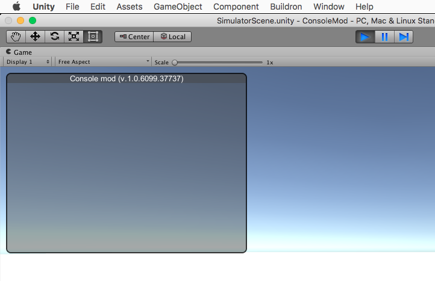
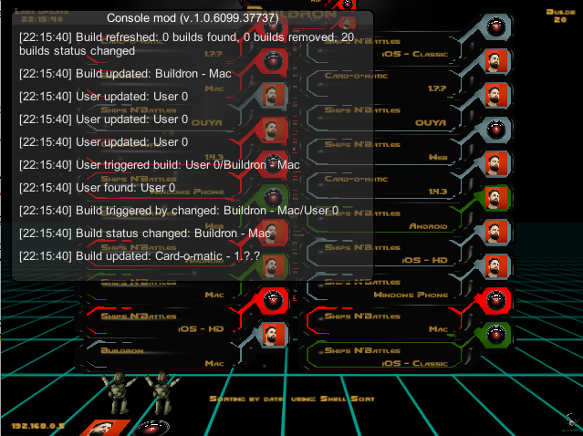

In this post we’ll create a mod that adds a console window to Buildron and let you monitor its events. Our ConsoleMod will have 2 classes: ModController and Mod.


ModController class
======
ModController class will be a MonoBehaviour responsible to showing to the user a window where the Buildron events will be logged. It’s a very simple Unity3d MonoBehaviour that use some GUILayout stuffs to build its UI.

Mod class
======
Mod class is the basic class for every Buildron mod and it will be responsible to creating the ModController GameObject and attach to listen a lot of the Buildron events.

## Download Buildron-Mod-Template
Go to Buildron [release page](https://github.com/skahal/Buildron/releases) and download Buildron-Mod-Template.zip

## Create your mod solution
Unzip the Buildron-Mod-Template.zip.

Open a prompt/terminal and go to the folder of unzip Buildron-Mod-Template.

Type:

```shell
jumpstart.exe -n ConsoleMod
```

> If you are using jumpstart in Mac/Linux, remember to call it with "mono " prefix.


A folder called ConsoleMod should be created. Open the src/Code/ConsoleMod.sln.

## Creating ModController class
Delete the sample file BoxController.cs

Create a new class called ModController and add the code below to it:

```csharp
public class ModController : MonoBehaviour
{
   #region Fields
   private string m_title;
   private Rect m_windowRect = new Rect(10, 10, 400, 300);
   private List<string> m_msgs = new List<string>();
   #endregion

   #region Constructors
   public ModController()
   {
      m_title = "Console mod (v.{0})".With(GetType().Assembly.GetName().Version);
   }
   #endregion

   #region Methods    
   /// <summary>
   /// Adds the message to the console window.
   /// </summary>
   /// <param name="message">The message.</param>
   /// <param name="args">The arguments.</param>
   public void AddMessage(string message, params object[] args)
   {
      var formattedMessage = message.With(args);
      m_msgs.Insert(0, "[{0:HH:mm:ss}] {1}".With(DateTime.Now, formattedMessage));

      if (m_msgs.Count > 10)
      {
         m_msgs.RemoveAt(10);
      }
   }

   void OnGUI()
   {
      GUILayout.Window(1, m_windowRect, HandleWindowFunction, m_title, GUILayout.MinWidth(100), GUILayout.MinHeight(100));
   }

   void HandleWindowFunction(int id)
   {
      GUILayout.BeginVertical();

      foreach (var msg in m_msgs)
      {
         GUILayout.Label(msg);
      }

      GUILayout.EndVertical();
   }
   #endregion
}
```

## Creating the Mod class
Replace the content of Mod.cs with the code below:

```csharp
using Buildron.Domain.Mods;
using UnityEngine;

namespace ConsoleMod
{
	/// <summary>
	/// Responsible to create the ModController GameObject and attach to listen a lot of the Buildron events.
	/// </summary>
	public class Mod : IMod
	{
		/// <summary>
		/// Initialize the mod with the context.
		/// </summary>
		/// <param name="context">The mod context.</param>
		public void Initialize(IModContext context)
		{
			var controller = CreateModController();
			ListenEvents(context, controller);            
		}

		private static ModController CreateModController()
		{
		    	var go = new GameObject("ConsoleController");
		    	return go.AddComponent<ModController>();
		}

		private static void ListenEvents(IModContext context, ModController controller)
		{
			    context.BuildFound += (sender, e) =>
			    {
				        controller.AddMessage("Build found: {0}", e.Build);
			    };

			    context.BuildRemoved += (sender, e) =>
			    {
				controller.AddMessage("Build removed: {0}", e.Build);
			    };

			    context.BuildsRefreshed += (sender, e) =>
			    {
				controller.AddMessage("Build refreshed: {0} builds found, {1} builds removed, {2} builds status changed", e.BuildsFound.Count, e.BuildsRemoved.Count, e.BuildsStatusChanged.Count);
			    };

			    context.BuildStatusChanged += (sender, e) =>
			    {
				controller.AddMessage("Build status changed: {0}", e.Build);
			    };

			    context.BuildTriggeredByChanged += (sender, e) =>
			    {
				controller.AddMessage("Build triggered by changed: {0}/{1}", e.Build, e.Build.TriggeredBy);
			    };

			    context.BuildUpdated += (sender, e) =>
			    {
				controller.AddMessage("Build updated: {0}", e.Build);
			    };

			    context.CIServerStatusChanged += (sender, e) =>
			    {
				controller.AddMessage("CI server status changed: {0}", e.Server.Status);
			    };

			    context.RemoteControlChanged += (sender, e) =>
			    {
				controller.AddMessage("RC changed: {0}", e.RemoteControl);
			    };

			    context.UserAuthenticationCompleted += (sender, e) =>
			    {
				controller.AddMessage("User authentication completed: {0}:{1}", e.User, e.Success ? "success" : "failed");
			    };

			    context.UserFound += (sender, e) =>
			    {
				controller.AddMessage("User found: {0}", e.User);
			    };

			    context.UserRemoved += (sender, e) =>
			    {
				controller.AddMessage("User remoed: {0}", e.User);
			    };

			    context.UserTriggeredBuild += (sender, e) =>
			    {
				controller.AddMessage("User triggered build: {0}/{1}", e.User, e.Build);
			    };

			    context.UserUpdated += (sender, e) =>
			    {
				controller.AddMessage("User updated: {0}", e.User);
			    };
		}
	}
}
```

**Compile the project.**


## Testing on mod simulator
Open the project src/Unity/ConsoleMod inside Unity3d editor.

Open SimulatorScene.

Hit the "Play" button.

You should see a scene like this:


In the menu "Buildron", click on "Show Simulator".

Click on "BuildFound", "BuildStatusChanged" and "BuildRemoved" buttons, you should see these events been registered on ConsoledMod window.


Hit the "Play" button again to stop playing the scene.

> There are two folders inside your Unity3d project called "Materials" and "Prefabs". They are created from Buildron-Mod-Template, but ConsoleMod don't need them. You can remove them.

## Building the mod
ConsoleMod has no Unity3d assets, in this case you don't need to use the menu "Buildron / BuildMod", you just need to compile your project inside your IDE, as we did on section "Creating the Mod class" to get your mod inside Buildron.

## Testing on Buildron
Go to folder ConsoleMod/build and open the Buildron of your platform.

Hit the play button on Buildron.

You should see the ConsoleMod window registering a lot of Buildron events.


## Conclusion
That's it! We created a Buildron mod that can help to debug what is happening in Buildron and mods in runtime.

So, why you don't try to **create your own Buildron mod now**?

You can see the full source code of this post on [https://github.com/giacomelli/Buildron-ConsoledMod](https://github.com/giacomelli/Buildron-ConsoledMod).
