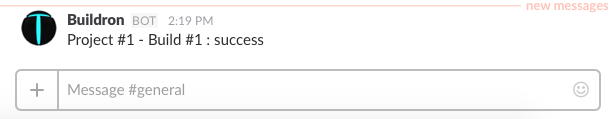

I was looking for a way to send a message to a Slack channel using the Slackbot API. 

This is a pretty easy task to perform in C#, because there are some great client libraries implementations to the Slack API, like: [SlackApi](https://github.com/Inumedia/SlackAPI), [MargieBot](https://github.com/jammerware/margiebot) and [SlackConnector](https://github.com/noobot/SlackConnector). However, in the Unity3d world the story is a little different, because Unity3d uses a older .NET version and those mentioned client libraries are implemented using newer .NET framework versions that are incompatible with Unity3d.

I could have tried to compile those client libraries projects using a older .NET version, what I really tried to do, but almost all are using things like Task and async, that are really not supported by Unity3d .NET version right now.

Then I decided to try a very raw solution using the Unity3d WWWForm and it worked well, very simple, but can be useful to someone. The result is the code bellow:



BotController
======

```csharp
public class BotController : MonoBehaviour
{

private void Start()
{
   Send("Hello world!");
}
		
/// <summary>
/// Sends a message to a Slack channel using the Slackbot API through the chat.postMessage (https://api.slack.com/methods/chat.postMessage)
/// </summary>
private void Send(string message)
{
	Debug.Log("Sending message '{0}'...", message);
	
	var url = "https://slack.com/api/chat.postMessage";
	var data = new WWWForm();
	
	// Create your Slackbot and its API token here: https://my.slack.com/services/new/bot
	data.AddField("token", "YOUR SLACK BOT API TOKEN");
	
	// The Slack channel.
	data.AddField("channel", "general");
	
	// How the Slack bot will be identified in Slack.
	data.AddField("username", "Buildron");
	
	// Your bot icon url image.
	data.AddField("icon_url", "https://raw.githubusercontent.com/skahal/Buildron/master/docs/images/Buildron-logo-128x128.png");
	
	data.AddField("text", message);

	var post = new WWW(url, data);
	StartCoroutine(WaitForPost(post));
}

private IEnumerator WaitForPost(WWW post)
{
	yield return post;

	m_log.Debug("Message sent.");
}
```
